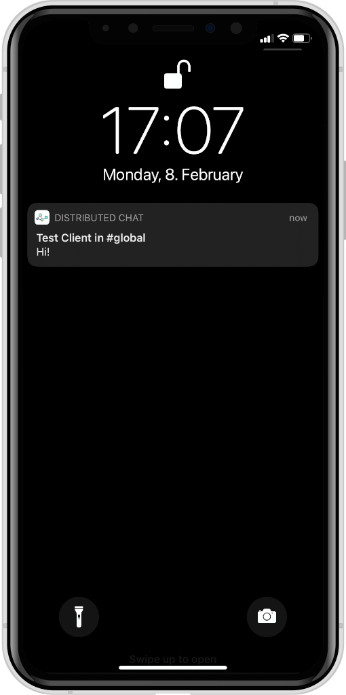
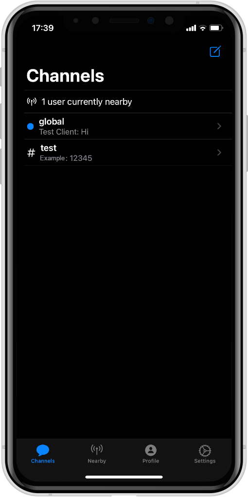
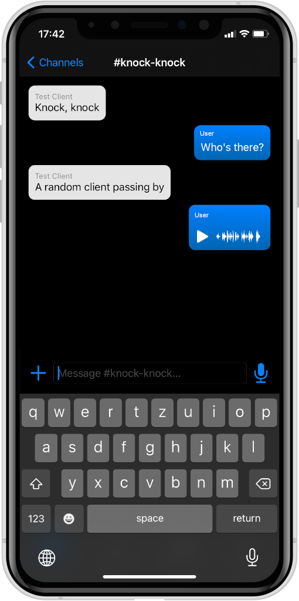
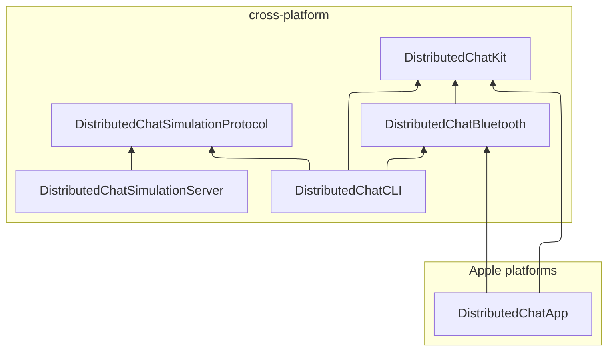

# Distributed Chat

[](https://github.com/fwcd/distributed-chat/actions/workflows/kit.yml)
[](https://github.com/fwcd/distributed-chat/actions/workflows/bluetooth.yml)
[](https://github.com/fwcd/distributed-chat/actions/workflows/app.yml)
[](https://github.com/fwcd/distributed-chat/actions/workflows/cli.yml)
[](https://github.com/fwcd/distributed-chat/actions/workflows/simulation-protocol.yml)
[](https://github.com/fwcd/distributed-chat/actions/workflows/simulation-server.yml)

<div align="center">
<p>

</p>

<p>



</p>
</div>

A distributed chat messenger that uses Bluetooth LE mesh networks.

* Fully decentralized architecture, no server or Internet connection required
* Message caching, delayed transmission
* Public and private end-to-end-encrypted messaging channels
* Voice messages, image, file and contact attachments
* Full simulation environment with configurable nodes, links and much more included
* Cross-platform, portable core

## Components

The project consists of the following components:

* `DistributedChatKit`: The abstract application, platform-independent, transport-independent (uses interface for broadcasting/receiving messages)
* `DistributedChatBluetooth`: An abstraction over platform-specific Bluetooth LE transports
* `DistributedChatApp`: The iOS/macOS implementation, uses Bluetooth LE as transport, does **not** require a server
* `DistributedChatCLI`: The CLI implementation, uses either HTTP/WebSockets as transport with the simulation server or Bluetooth LE (WIP)
* `DistributedChatSimulationProtocol`: The high-level JSON-based protocol used between CLI and simulation server
* `DistributedChatSimulationServer`: The companion server for the CLI, relays messages between connected CLI nodes, provides web-interface for configuring links between nodes
* `Scripts`: Scripts for launching CLI instances conveniently and for testing the BLE transport

The dependency graph between these packages looks like this:



## Building and Running

First, make sure to have Swift 5.10+ or newer installed. Recent versions for Ubuntu and macOS can be found [here](https://swift.org/download/).

### Simulation Server

To run the simulation server, navigate into the directory `DistributedChatSimulationServer` and execute:

```
swift run
```

The web interface should now be accessible at `http://localhost:8080`.

### CLI

To start a single instance of the CLI, make sure that the simulation server is running, navigate into `DistributedChatCLI` and execute:

```
swift run DistributedChatCLI --name Alice
```

You can substitute any name for Alice. Once the CLI has started, the chosen name should show up as a node in the simulation server's web interface.

For convenience, there is a bash script for starting multiple instances of the CLI together in a single `tmux` session. To use it, navigate into the root directory of this repository and run

```
Scripts/start_clis Alice Bob Charles Dave
```

...or however many clients you want to start. To stop all clients at once, press `Ctrl + B` then type `:kill-session` and press enter.

### iOS app

Building and running the iOS app is only possible on macOS, so make sure to have the following available:

* Xcode 15.4+
* Swift 5.10+ (should be included with Xcode)
* optionally an iOS device

The open the `DistributedChatApp` subdirectory in Xcode and build/run the project.
